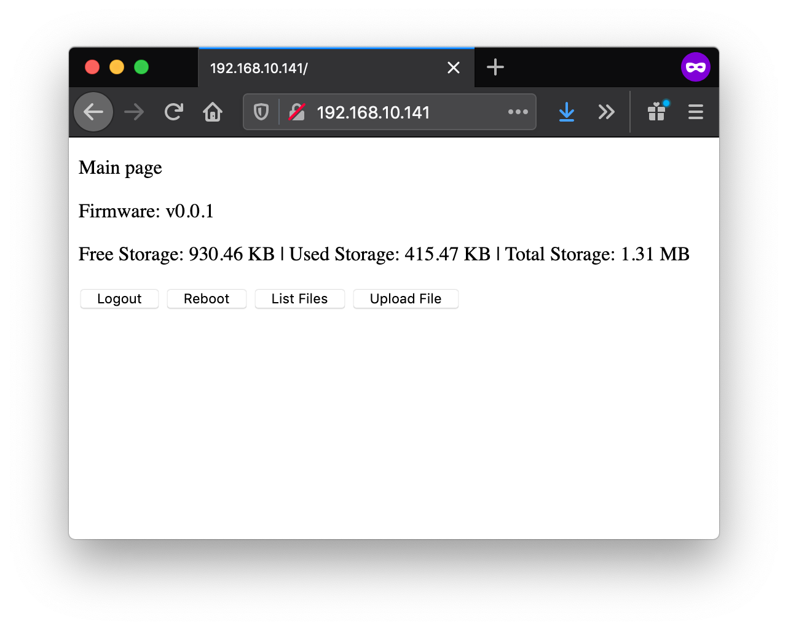
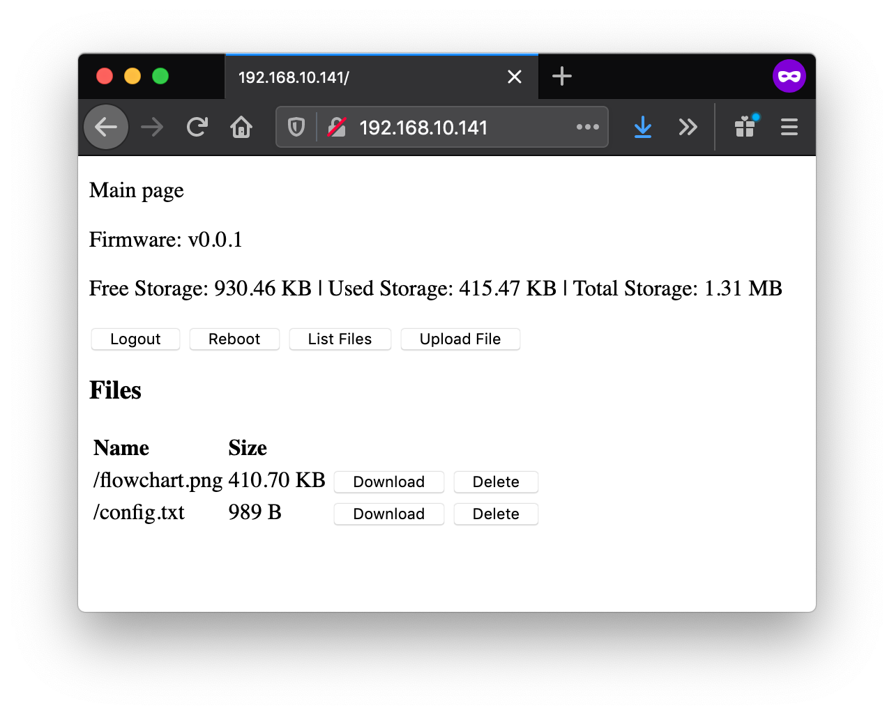
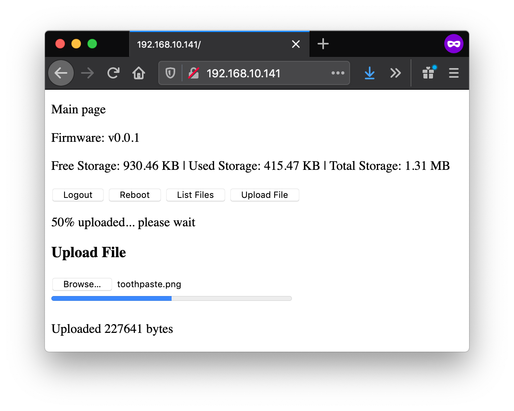
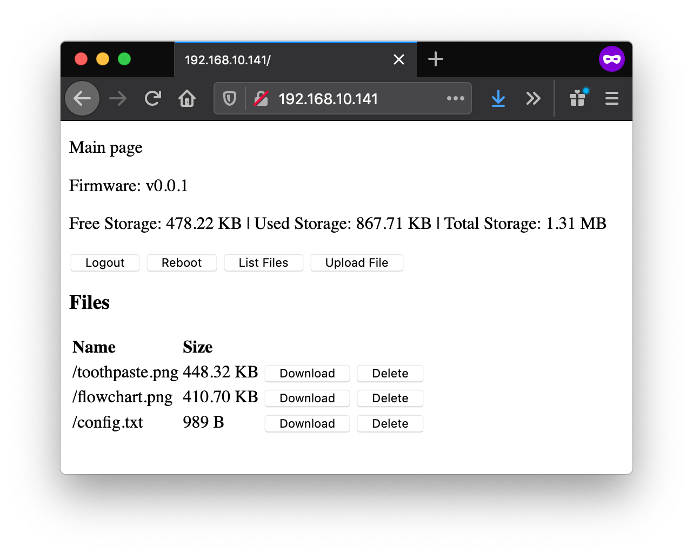

## Example 2 - Single Webpage, Authentication, File Management, Upload with Progress Bar
- web page authentication
- single webpage
- file listing button
- file download button
- file delete button
- file upload button
- reboot esp32 button
- all done on a single web page that updates webpage elements using javascript

## Configuration
Edit these variables at the beginning of example-02.ino

```
const String default_ssid = "somessid";
const String default_wifipassword = "mypassword";
const String default_httpuser = "admin";
const String default_httppassword = "admin";
const int default_webserverporthttp = 80;
```

## Screenshots
<p align="center">
  
</p>
<p align="center">
  
</p>
<p align="center">
  
</p>
<p align="center">
  
</p>
